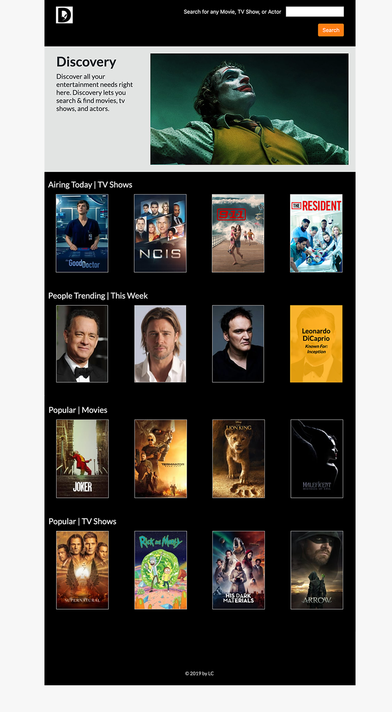

# Discovery
+ The Discovery application allows users to search for all entertainment, and even view what's airing today.
+ The Movie Database is the supporting database for all information relating to this project.



## How it works
+ The Application's controller handles request of the **index** page, the **search** bar, and the _required_ **api key**.

## Get Details
For example: **Airing Today | TV Shows**

/tv/airing_today<br>
>Get the primary TV show details by id.

| api_key   | string    | **required** |
| --------- | --------- | ------------ |
| language  | string    | optional     |
| --------- | --------- | ------------ |
| page      | integer   | optional     |

```
https://api.themoviedb.org/3/tv/airing_today?api_key=<<api_key>>&language=en-US&page=1
```

## Dependencies
+ The application runs on Rails 5.2.3

## Installation
+ Fork Project
+ Open terminal
+ Locate the directory
+ Run application by starting the rails server.
   Command Line: 'rails s'
+ Open a browser window to: http://localhost:3000/
+ Click, Hover -or Search for any person, title, movie -or show! =]

## Version 0.1
+ This application is ran by (1) forking the project, (2) using the rails server, and (3) open a browser to view
+ This project will be uploaded to a web host.
+ The **goal** is to further improve upon the features within the App.

## Releases
+ version 0.1 - self maintaining application

## Relative links
[License for this project](docs/License.md)

[Code of Conduct for this project](docs/Code_of_Conduct.md)
