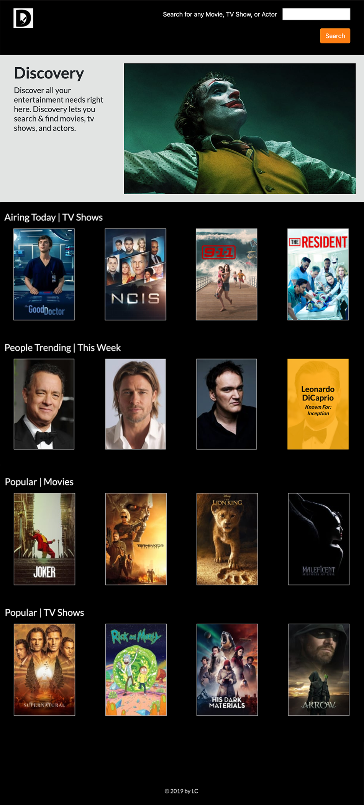

# Discovery
+ The Discovery application allows users to search all Popular Movies, TV Shows, People, and even view what's airing today!

+ The Movie Database (TMDB) is the supporting database for all information relating to this project.



## How it works
+ The Application's controller handles request of the **index** page, the **search** bar, and the _required_ **api key**.

## Example of the API
The row of 'Airing Today | TV Shows'

#### Get Details
```
/tv/{tv_id}
_Get the primary TV show details by id._
tv_id     integer   **required**
api_key   string    **required**

**https://api.themoviedb.org/3/tv/{tv_id}?api_key=<<api_key>>&language=en-US**
```

## Dependencies
+ The application runs on Rails 5.2.3

## Installation
+ Fork Project
+ Open terminal
+ Locate the directory
+ Run application by starting the rails server.
   Command Line: 'rails s'
+ Open a browser window to: http://localhost:3000/
+ Click, Hover -or Search for any person, title, movie -or show! =]
